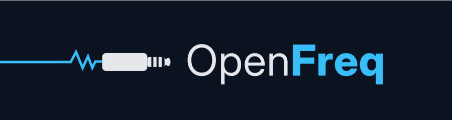
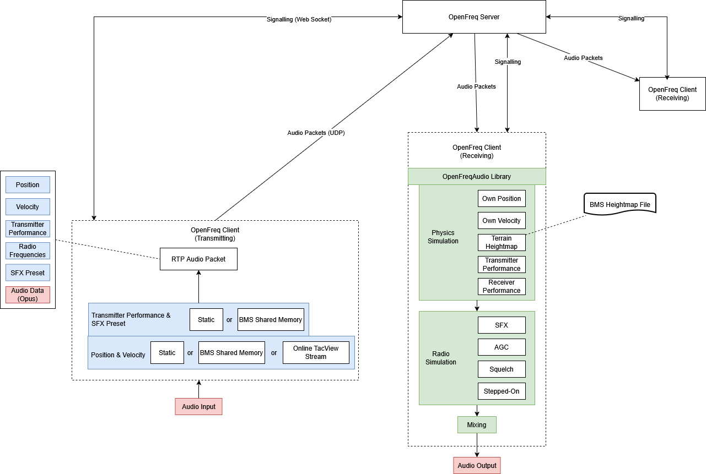

# OpenFreq

Real-time network voice radio with real-time physics simulation for [Falcon BMS](https://www.falcon-bms.com/).


## Features
- Seamless integration into Falcon BMS - no extra configuration required
- Realistic radio propagation: signal strength, line-of-sight, Doppler and more (via [OpenFreqAudio](https://github.com/UOAF/OpenFreqAudio))
- Frequency-based voice channels with per-channel PTT and hotkeys (keyboard or joystick)
- [Realistic AM simulation including squelch](https://bitbashing.io/am-radio.html)
- Hot-swappable audio devices
- Dedicated GCI (Ground Controlled Intercept) client mode with unlimited positions & channels
- Full 3D audio effects enabled in GCI mode — identical physics simulation as BMS mode
- GCI Position sources: static via map UI picker & address search or live Tacview/ACMI feed
- Transmitter / Receiver performance presets and SFX
- Opus audio compression and modern RTP stack
- Peer list
- Experimental: sidetone (microphone monitoring)
- Server: Native Windows & Linux support
- Client: Native Windows & Linux support (GCI mode only), BMS mode tested in WINE (see the [Handbook](docs/handbook.md "Handbook") for detailed WINE info)


## Quick Start
### BMS Mode
1. Make sure IVC is not running
2. Launch BMS and OpenFreq in any order
3. Check that OpenFreq is set to BMS mode
4. Connect via BMS UI and enter OpenFreq server address in the BMS IVC field. Make sure the IVC checkbox is selected in BMS.

### GCI Mode
*Note: BMS is not required for GCI Mode*

1. Launch OpenFreq Client, set it to GCI Mode
2. Select Theater. Linux: specify Theater heightmap file
3. Enter connection data and Display name, Connect
4. Don't forget to switch to "Game" mode when clients move to 3D


### Server
1. Verify ports 9987 (TCP), 9988 (UDP) are open (default configuration)
2. Launch OpenFreq Server (sensible defaults preconfigured)
3. The configuration file is automatically created (``OpenFreq.Server.json``) - adapt and restart if necessary

#### Container (Podman / Docker)

```bash
docker run -d --name openfreq-server \
  -p 9987:9987 -p 9988:9988/udp \
  ghcr.io/uoaf/openfreq-server:latest
```

Available tags: `latest`, `<x.y.z>`, `nightly`. See the [Handbook](docs/handbook.md "Handbook") for configuration details.


## Documentation
See the [Handbook](docs/handbook.md "Handbook") for in-depth usage and configuration.

## Requirements

- **Self-contained builds** — no dependencies, runs as-is
- **Framework-dependent builds** — requires [.NET 10.0 Runtime](https://dotnet.microsoft.com/download/dotnet/10.0)
- **Building from source** — requires [.NET 10.0 SDK](https://dotnet.microsoft.com/download/dotnet/10.0)

## Architecture



| Component | Role |
|---|---|
| `OpenFreq.Server` | Central relay — signaling (WebSocket) + audio (UDP) |
| `OpenFreq.Client` | Avalonia desktop GUI for end users |
| `OpenFreq.Common` | Shared protocol, RTP pipeline, jitter buffer |
| `OpenFreq.Testclient` | Minimal CLI client for testing |

## Build & Run

```bash
# Build all
dotnet build OpenFreq.sln

# Run server
dotnet run --project OpenFreq.Server/OpenFreq.Server.csproj

# Run client
dotnet run --project OpenFreq.Client/OpenFreq.Client.csproj
```

## Contributing

Pull requests are welcome. Due to the complexity of the project, please keep them small. For bugfixes, please specify clear testing/repro cases.

## License

[Mozilla Public License 2.0](LICENSE.md)
