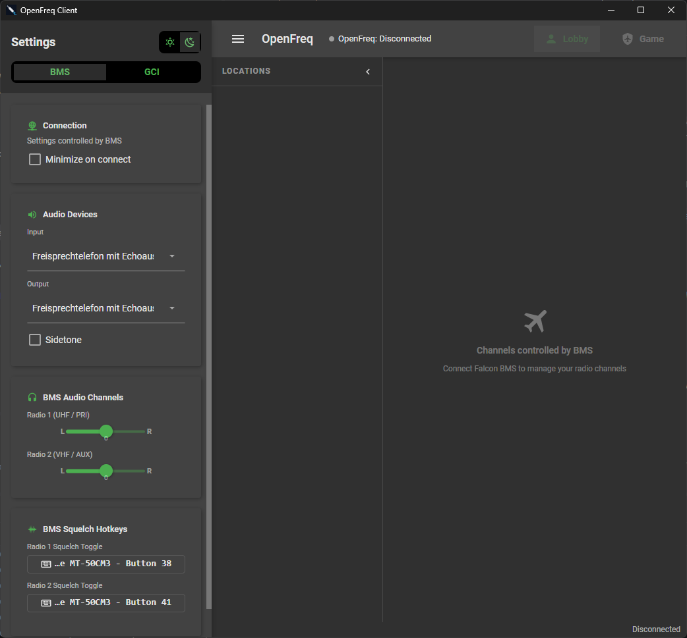
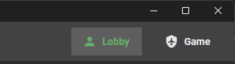
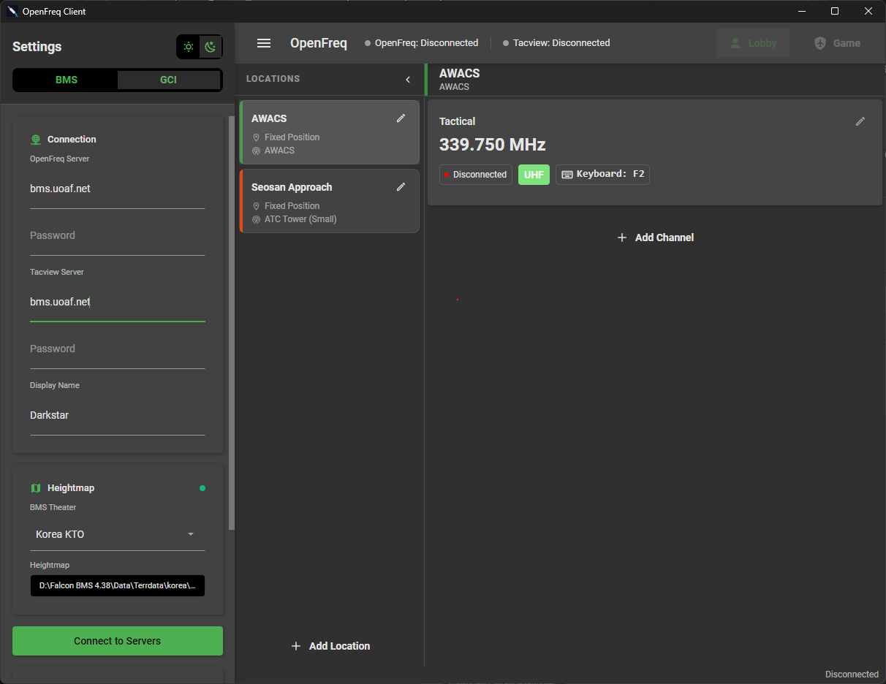
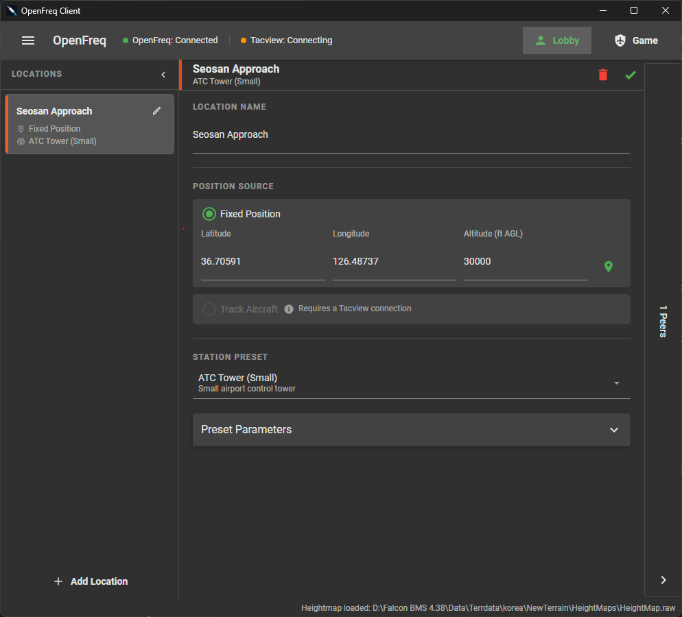

---
{}
---
# OpenFreq Handbook

Physics-based multiplayer radio communication for Falcon BMS.

---

## Contents

1. [Installation](#1-installation "Installation")
2. [Server](#2-server "Server")
3. [Client - BMS Mode](#3-client---bms-mode "Client - BMS Mode")
4. [Client - GCI Mode](#4-client---gci-mode "Client - GCI Mode")

---

## 1\. Installation

All OpenFreq components (Server and Client) can be run as-is. If you prefer smaller executables and have a local .NET 10 runtime, use the respective packages.

In any case, extract the files of the archive into a directory of your choice. All components will auto-create their configuration files and a log folder on first launch.

**It is not required to delete or replace any existing IVC executables.**

> **Note:** Client and Server must run the same OpenFreq version - the server rejects clients with a different version. Patch releases (e.g. 1.0.0 and 1.0.1) are compatible with each other.

## 2\. Server

### Requirements

- Windows or Linux
- .NET 10 runtime (or use the portable version)
- Ports **9987** (WebSocket/TCP) and **9988** (UDP) open and forwarded if hosting publicly

> **Note:** The Server does not require a BMS installation. It can run on any machine, as long as the ports are open.

### First Run

Run the server binary or:

```bash
dotnet run --project OpenFreq.Server
```

On first launch the server creates `OpenFreq.Server.json` next to the binary with default values. Edit this file before restarting to change any setting.

### Configuration - `OpenFreq.Server.json`

| Field                  | Default | Description                                              |
| ---------------------- | ------- | -------------------------------------------------------- |
| `serverPassword`       | `""`    | Password clients must supply. Empty = no auth required.  |
| `websocketPort`        | `9987`  | TCP port for the WebSocket signaling connection.         |
| `audioPort`            | `9988`  | UDP port for RTP audio relay.                            |
| `maxClientsPerChannel` | `50`    | Max simultaneous clients on one frequency.               |
| `maxChannelsPerClient` | `10`    | Max frequencies a single client may join.                |
| `opusCompression`      | `true`  | Enable Opus audio encoding. Disable only for debugging.  |
| `broadcastPeerUpdates` | `true`  | Broadcast peer join/leave events to all channel members. |

> For **TvT Setups**, it is recommended to set up one server process per team in different directories with separate config files, different port setups and different passwords. The server can be spawned in any number of processes as long as the configured ports are not in use.

### TUI

The server runs a Terminal.Gui interface with three tabs:

- **Frequencies** - active channels and client counts per frequency
- **Clients** - connected client list with IDs and display names
- **Logs** - live log stream

Press **Ctrl+Q** or close the terminal to shut down gracefully.

### Headless Mode

Start the server with `-a` (or `--headless`) to run without the TUI, e.g. for systemd services or Docker containers. Logs are written to the console and the log file instead. Shut down with **Ctrl+C**.

### Docker

Prebuilt server images are published to the GitHub Container Registry:

| Tag | Contents |
| --- | --- |
| `ghcr.io/uoaf/openfreq-server:latest` | Latest stable release |
| `ghcr.io/uoaf/openfreq-server:<x.y.z>` | Specific release (e.g. `1.0.0`) |
| `ghcr.io/uoaf/openfreq-server:nightly` | Latest `develop` build, replaced on every push |

```bash
docker run -d --name openfreq-server \
  -p 9987:9987 -p 9988:9988/udp \
  -v ./OpenFreq.Server.json:/app/OpenFreq.Server.json \
  ghcr.io/uoaf/openfreq-server:latest
```

The container runs in headless mode. Configuration is read from `/app/OpenFreq.Server.json` (a default is created on first start if none is mounted). Logs go to the container output and `/app/logs`.

### Linux Desktop Entry

A desktop entry and icon are included under `OpenFreq.Server/util/linux/` for launching the server from the application menu. The entry assumes the server is installed in `/opt/openfreq` - edit `Exec` and `Path` in the file if you installed it elsewhere.

```bash
cp OpenFreq.Server/util/linux/openfreq-server.desktop ~/.local/share/applications/
cp OpenFreq.Server/util/linux/openfreq-server.png ~/.local/share/icons/
```

The entry launches the server in a terminal with the TUI.

### Log Files

Logs are written to `logs/openfreq-YYYY-MM-DD.log` next to the binary. The last 30 days are kept automatically.

### Firewall

Open both ports in both directions:

```
TCP 9987  (WebSocket signaling)
UDP 9988  (audio relay)
```

---

## 3\. Client - BMS Mode



BMS mode requires **Windows or WINE**. The client reads radio state and position data directly from Falcon BMS shared memory - no manual frequency configuration needed.

### Prerequisites

- Windows native or WINE (tested with wine-11.0 staging)
- Falcon BMS 4.38 or later
- IVC client **not** running - OpenFreq detects IVC and will offer to kill it automatically

### Linux Prerequisites

> **Note:** These prerequistes are only necessary for BMS mode. If you want to run GCI mode in Linux, just use the native OpenFreq Linux Client.

Make sure you installed BMS with the bms-helper script (https://github.com/BenchmarkSims/bms-helper/).
WINE works best with the portable version of the BMS clients as this supplies its own .NET environment.

In order for the BMS client to work in BMS mode, it must be launched in the same wineprefix as your BMS installation:

```
# Adapt this to your BMS root path
export WINEPREFIX="/home/my-user/Games/falcon-bms"

# Adapt this to your path and your runners
export STEAM_COMPAT_CLIENT_INSTALL_PATH="/home/my-user/Games/falcon-bms/runners/GE-Proton10-32"

export STEAM_COMPAT_DATA_PATH="$WINEPREFIX"
"/home/my-user/Games/falcon-bms/runners/GE-Proton10-32/proton" run "OpenFreq.Client.exe"
```

Either run those commands in your terminal or even better create a shell script.

> **Warning:** The current version of the bms-launcher kills all WINE applications in the same prefix. **You must first launch Falcon BMS (via the bms-launcher) and then the OpenFreq.Client.exe**


> **Info:** The BMS WINE prefix seems to override the window manager. It is suggested to disable the version "Minimize on connect" in the OpenFreq Client to avoid a corrupted UI.

### First-Time Setup

1. Launch the OpenFreq client.
2. Open **Settings** (drawer on the left).
3. Set **Mode** to **BMS**.
4. Select your **Theater** from the dropdown. If BMS is installed, theaters are detected automatically and the heightmap path is filled in for you.
5. Select your **Input** and **Output** audio devices.
6. Set a **Display Name** (used as your callsign in GCI mode; in BMS mode your logbook callsign overrides this automatically).
7. Optionally configure **UHF Squelch** and **VHF Squelch** hotkeys (see [Squelch](#squelch "Squelch") below).
8. Click **Save** / close the drawer.

### Connecting

In BMS mode the client is launched and connected **by BMS itself** when you connect in BMS. BMS passes the server address, port, and password from its voice configuration.
**Make sure that the IVC checkbox is selected in the BMS connection window. AGC currently has no effect.**

The connection flow:

1. BMS signals OpenFreq to connect -> client connects to the server automatically.
2. On successful auth the window minimizes (configurable via **Minimize on Connect**).
3. When BMS enters 3D -> **Game mode** activates; RF physics (path loss, Doppler, terrain diffraction) apply to all audio.
4. BMS exits 3D -> Lobby mode activates.
5. BMS disconnects -> OpenFreq disconnects

### Radio Channels

OpenFreq reads the BMS shared memory. It tracks:

- **Radio 1 (UHF for the F-16)**: frequency and power state
- **Radio 2 (VHF for the F-16)**: frequency and power state
- **Guard**: tied to Radio 1 as per BMS implementation.

Frequency changes in the cockpit are reflected instantly in OpenFreq. When a radio is switched off or tuned to the parking frequency (9999 kHz) the channel is disconnected automatically.

> **Note:** For F-16 and F-15, OpenFreq automatically selects the correct radio hardware preset (transmit power, receiver sensitivity, noise SFX) for that airframe. For all other aircraft it uses a generic preset.

### Lobby Mode / Game Mode



This mode reflects current IVC implementation: in Lobby mode, all audio communication is transmitted and received as-is without any changes.

Game mode is tied to BMS state:

- **Game Mode (in 3D):** RF propagation physics active. Audio volume, SNR, and Doppler shift are calculated from your position relative to the transmitter using the theater heightmap for terrain diffraction.
- **Lobby Mode (in 2D):** Standard voice chat; no propagation modeling.

Only clients in the same mode (3D or lobby) can hear each other on a given frequency.

### Squelch

Squelch lets you manually open/close squelch on the UHF or VHF radio (useful when flying low or behind terrain). Assign hotkeys via **Settings ->Radio 1 Squelch Hotkey** and **Radio 2 Squelch Hotkey**. The hotkeys are only active when Game mode is on.

### Pan

Set **Radio 1 Pan** and **Radio 2 Pan** in settings to spatially position UHF and VHF audio left/right in your headset (e.g., UHF left, VHF right).

### Sidetone

Enable **Sidetone** to hear your own transmissions in the headset. Adjust volume with the sidetone slider.

---

## 4\. Client - GCI Mode



GCI mode is for ground-based operators (controllers, JTAC, AWACS players) who are **not** inside a BMS cockpit. It works on Windows and Linux.

In GCI mode you manually define your **location** (position on the theater map) and the **channels** (frequencies) you monitor. RF propagation applies based on your configured position.

### Prerequisites

- Windows or Linux
- HeightMap file of the Theater OR Falcon BMS installed
- A suitable GCI tool like [OpenRadar](https://github.com/uoaf/openradar)

### Setup

1. Launch the OpenFreq client.
2. Open **Settings**.
3. Set **Mode** to **GCI**.
4. Enter the **Server Address** (`host:port`, e.g. `192.168.1.10:9987`) and **Password**.
5. Select your **Theater**.
6. Set the **Heightmap Path** - this is required in GCI mode. It is the `.raw` heightmap file for the theater. If BMS is installed on the same machine, select the theater from the dropdown to fill this in automatically.
   
   The heightmap can be found in the `\TerrData\<Terrain Name>\NewTerrain\HeightMaps` subfolder of your BMS 4.38 directory.
7. Optionally enter a **Tacview Server Address** and password if you want live positional tracking via Tacview ACMI.

	The BMS Tacview stream is only available when the respective client is in 3D. You can enter the **Tacview Server Address** before the connection is possible - OpenFreq will automatically try to connect indefintely as long as you are connected to the OpenFreq Server.
8. Select **Input** and **Output** audio devices.
9. Set a **Display Name** - this is your callsign shown to other clients.


### Locations

A **Location** represents a physical radio station (e.g. a GCI radar site, AWACS orbit, or JTAC position). Each location has:

- **Name** - shown to other clients
- **Latitude / Longitude / Altitude (ft)** - determines RF line-of-sight and propagation
- **Radio Station Preset** - hardware preset affecting transmit power and receiver sensitivity (e.g. AWACS, ground station)
- **Channels** - the frequencies this location monitors



#### Setting Position

Use the **map picker** button on the location card to click your position on the theater map, or enter coordinates manually. Coordinates are validated against theater bounds.

If Tacview ACMI is connected, you can optionally **track an aircraft callsign** - the location's position updates live as that aircraft moves (useful for airborne controllers).

### Channels

Each channel is a frequency entry under a location. Per channel you configure:

- **Frequency (MHz)** - entered as a decimal, stored internally in kHz
- **Name** - label for the channel card (e.g. "Overlord A")
- **PTT Hotkey** - key or key combination to transmit on this channel. Direct Input devices (joysticks, gamepads) are supported in Windows.

> **Note:** Since some aircraft (e.g. the F-15) have multiple, independent radios of the same type, the same frequency can be tuned multiple times per location. In GCI mode, those duplicate frequencies will behave as if each of them were slotted in a different radio (own pan control, etc). Transmission in this case will behave as if it originated from a single radio.

#### Adding a Channel

Click **Add Channel** on the location card. Set frequency and name, then click the key capture button to bind a PTT hotkey.

#### Joining / Leaving

Channels are auto-joined when OpenFreq connects. You can selectively disconnect from a single channel by clicking the **Connected** button.

You can also click **Join** directly from the **peer list panel** on the right - if another client is transmitting on a frequency you are not yet on, click the frequency row to add and join that channel instantly.

### Transmitting

Audio is transmitted either by **clicking & holding** a channel card or by using the configured **PTT hotkey**. Simultaneous transmissions are possible by either assigning the same hotkey multiple times or pressing multiple assigned hotkeys at once.

Release to stop the transmission. The channel card shows a transmit indicator while keyed. When transmitting on a channel, all other channels at the same location are automatically muted.

### Tacview / ACMI Integration

Enter a Tacview server address in settings to connect to Tacview's live telemetry feed. When connected:

- Aircraft callsigns appear in each location's **Track Aircraft** dropdown.
- Selecting a callsign makes the location follow that aircraft's position in real time.
- The map tracking window can be opened to observe the aircraft's current position and heading.

> Tacview ACMI is optional. Without it, position is static and set manually.

### Lobby Mode / Game Mode

Same function as in BMS-Mode. However this has to be set manually by the GCI when other players switch to 3D / 2D.

### Configuration Persistence

All locations, channels, hotkeys, and settings are saved automatically to `OpenFreq.Client.json` next to the client binary on exit. They are restored on the next launch.
